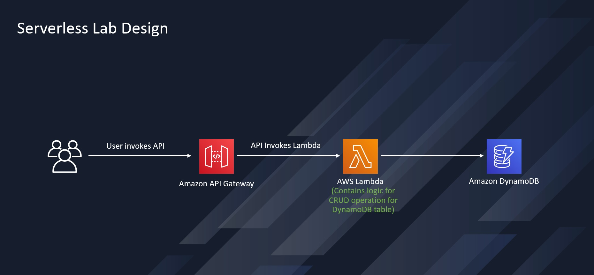
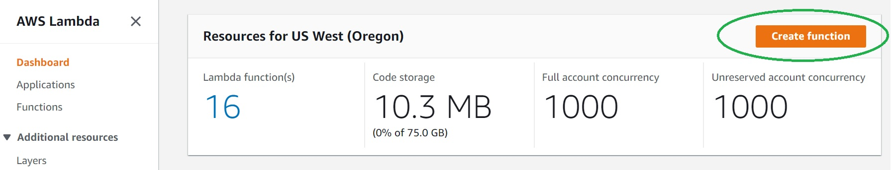
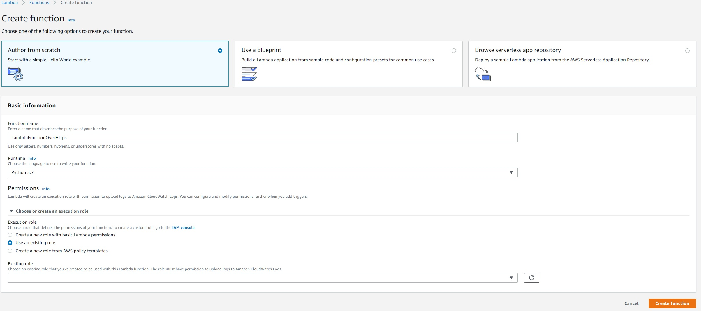
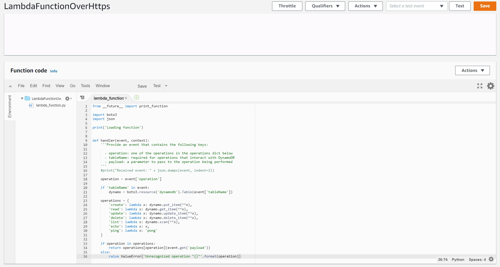
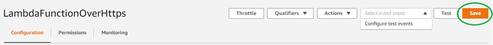
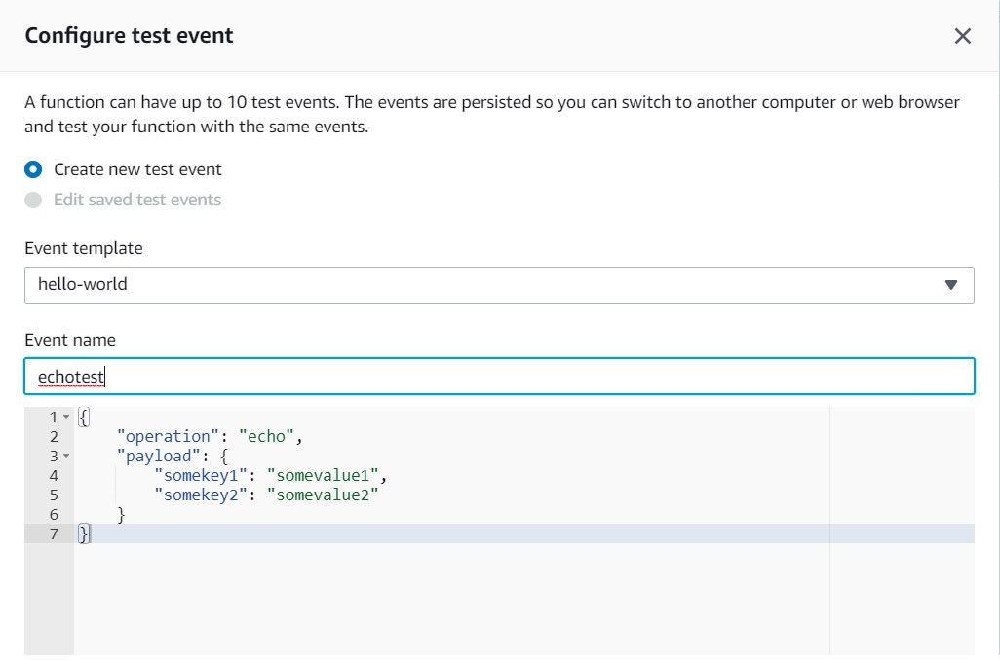
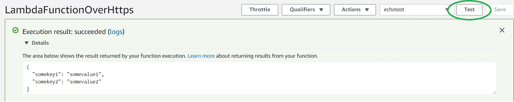

# LevelUp! Lab for Serverless

## Lab Overview And High Level Design

Let's start with the High Level Design.
. 
An Amazon API Gateway is a collection of resources and methods. For this tutorial, you create one resource (DynamoDBManager) and define one method (POST) on it. The method is backed by a Lambda function (LambdaFunctionOverHttps). That is, when you call the API through an HTTPS endpoint, Amazon API Gateway invokes the Lambda function.

The POST method on the DynamoDBManager resource supports the following DynamoDB operations:

* Create, update, and delete an item.
* Read an item.
* Scan an item.
* Other operations (echo, ping), not related to DynamoDB, that you can use for testing.

The request payload you send in the POST request identifies the DynamoDB operation and provides necessary data. For example:

The following is a sample request payload for a DynamoDB create item operation:

```json
{
    "operation": "create",
    "tableName": "lambda-apigateway",
    "payload": {
        "Item": {
            "id": "1",
            "name": "Bob"
        }
    }
}
```
The following is a sample request payload for a DynamoDB read item operation:
```json
{
    "operation": "read",
    "tableName": "lambda-apigateway",
    "payload": {
        "Key": {
            "id": "1"
        }
    }
}
```

## Setup

To follow the procedures in this guide, you will need a command line terminal or shell to run commands. Alternatively, you can use Postman to execute APIs

### Create Lambda IAM Role 
Create the execution role that gives your function permission to access AWS resources.

To create an execution role

1. Open the roles page in the IAM console.
2. Choose Create role.
3. Create a role with the following properties.
    * Trusted entity – Lambda.
    * Role name – **lambda-apigateway-role**.
    * Permissions – Custom policy with permission to DynamoDB and CloudWatch Logs. This custom policy has the permissions that  the function needs to write data to DynamoDB and upload logs. Note the Amazon Resource Name (ARN) of the role for later use.
    ```json
    {
    "Version": "2012-10-17",
    "Statement": [
    {
      "Sid": "Stmt1428341300017",
      "Action": [
        "dynamodb:DeleteItem",
        "dynamodb:GetItem",
        "dynamodb:PutItem",
        "dynamodb:Query",
        "dynamodb:Scan",
        "dynamodb:UpdateItem"
      ],
      "Effect": "Allow",
      "Resource": "*"
    },
    {
      "Sid": "",
      "Resource": "*",
      "Action": [
        "logs:CreateLogGroup",
        "logs:CreateLogStream",
        "logs:PutLogEvents"
      ],
      "Effect": "Allow"
    }
    ]
    }
    ```

### Create Lambda Function

**To create the function**
1. Click "Create function" in AWS Lambda Console

2. Select "Author from scratch". Use name **LambdaFunctionOverHttps** , select **Python 3.7** as Runtime. Under Permissions, select "Use an existing role", and select **lambda-apigateway-role** that we created, from the drop down
3. Click "Create function"

4. Replace the boilerplate coding with the following code snippet and click "Save"

**Example Python Code**
```python
from __future__ import print_function

import boto3
import json

print('Loading function')


def lambda_handler(event, context):
    '''Provide an event that contains the following keys:

      - operation: one of the operations in the operations dict below
      - tableName: required for operations that interact with DynamoDB
      - payload: a parameter to pass to the operation being performed
    '''
    #print("Received event: " + json.dumps(event, indent=2))

    operation = event['operation']

    if 'tableName' in event:
        dynamo = boto3.resource('dynamodb').Table(event['tableName'])

    operations = {
        'create': lambda x: dynamo.put_item(**x),
        'read': lambda x: dynamo.get_item(**x),
        'update': lambda x: dynamo.update_item(**x),
        'delete': lambda x: dynamo.delete_item(**x),
        'list': lambda x: dynamo.scan(**x),
        'echo': lambda x: x,
        'ping': lambda x: 'pong'
    }

    if operation in operations:
        return operations[operation](event.get('payload'))
    else:
        raise ValueError('Unrecognized operation "{}"'.format(operation))
```


### Test Lambda Function

Let's test our newly created function. We haven't created DynamoDB and the APi yet, so we'll do a sample echo operation. The function should output whatever input we pass.
1. Click the arrow on "Select a test event" and click "Configure test events"

2. Paste the following JSON into the event. The field "operation" dictates what the lambda function will perform. In this case, it'd simply return the payload from input event as output. Click "Create" to save
```json
{
    "operation": "echo",
    "payload": {
        "somekey1": "somevalue1",
        "somekey2": "somevalue2"
    }
}
```

3. Click "Test", and it will execute the test event. You should see the output in the console


We're all set to create an API, and use our lambda as backend!


